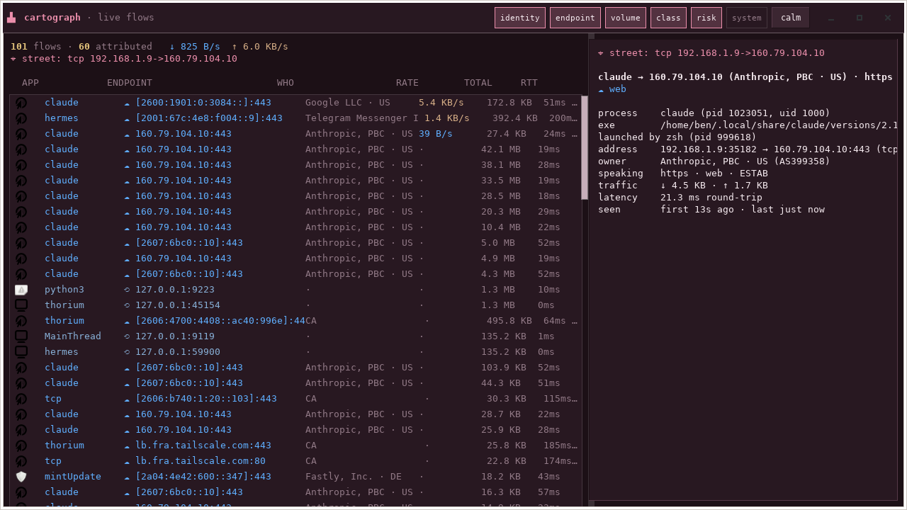

# Cartograph

> **A living map of your machine's network.** What's running and who it is
> talking to — live, by real name, with the *why* one click away, and honest
> `?` marks where the kernel won't say.



Linux makes you pick between pretty-but-shallow bandwidth dashboards and
deep-but-firehose packet tools. Cartograph is the missing layer: **per-process
attribution** (Wireshark can't) with honest unknowns — a kernel-owned or
other-user flow shows `pid 0` plus its service-derived name rather than a
guess — **human identity** — rDNS, passive DNS, and
offline GeoIP/ASN turn `160.79.104.10` into *Anthropic, PBC · US* (OpenSnitch
won't), a **plain-language "Why" panel** for any flow (nothing on Linux does),
and it's **native Zig + GTK4** end to end (Portmaster ships a browser).

Three faces over one shared view-model, parity by construction:

- **`surveyor`** — the capture core: one-shot tables, NDJSON streams, or a
  Unix-socket daemon. Unprivileged inet_diag + `/proc` by default; opt-in eBPF
  fuses in short-lived flows, UDP/QUIC byte counters, and passive-DNS names.
- **`cartograph`** — the TUI: category colours, sparklines, RTT, the Why panel.
- **`cartograph-gtk`** — the desktop app: app icons, exposure risk badges, lens
  toggles, the docked Why panel. Double-click it; it brings its own surveyor.

## Install

Grab the assets from the [latest release](https://github.com/RamenFast/cartograph/releases/latest):

```bash
# Debian / Ubuntu / Mint
sudo apt install ./cartograph_1.0.0_amd64.deb

# Fedora / openSUSE (built on Mint; payload rpm-verified — install reports welcome)
sudo dnf install ./cartograph-1.0.0-1.x86_64.rpm

# from source (any distro): Zig 0.16 + scdoc; clang/libbpf-dev for --bpf, libgtk-4-dev for the GTK app
tar xf cartograph-1.0.0-source.tar.gz && cd cartograph-1.0.0
mkdir -p toolchain && curl -fsSL https://ziglang.org/download/0.16.0/zig-x86_64-linux-0.16.0.tar.xz | tar -xJ -C toolchain
ln -sf zig-x86_64-linux-0.16.0/zig toolchain/zig
./packaging/build-deb.sh   # or: ./toolchain/zig build -Dbpf=true -Dgtk=true -Doptimize=ReleaseSafe
```

Verify: `surveyor --version` → `surveyor 1.0.0`.

Two optional one-liners unlock the full picture, loudly skipped otherwise:

```bash
cartograph-fetch-geoip     # offline GeoIP/ASN names (DB-IP Lite, CC-BY) → ~/.local/share/cartograph/geoip
sudo setcap cap_bpf,cap_perfmon,cap_net_admin,cap_net_raw+ep /usr/bin/surveyor   # eBPF realtime
```

## Use

```bash
cartograph-gtk                        # the window (also in your app menu)
cartograph                            # the TUI, in-process capture, no daemon
surveyor snapshot                     # one-shot table — pretty at a TTY

# the shared-daemon shape (one capture core, many observers, full-duplex):
surveyor serve --bpf --socket /tmp/cg.sock &
cartograph --socket /tmp/cg.sock      # and/or cartograph-gtk --socket /tmp/cg.sock
```

Keys in both frontends: click or `↑/↓` select a flow (the Why panel narrates
it), `p` cycles profiles (calm → nerd → security → resource), `1–6` toggle
lenses, `Esc` returns to orbit. The GTK headerbar has buttons for the same.

## The agent surface

Every verb is a real Unix program — NDJSON in a pipe, pretty at a TTY, and the
contract is self-describing. An AI watching your machine reads the same live
view-model the GUI renders ([docs/AGENT-INTERFACE.md](docs/AGENT-INTERFACE.md)):

```bash
surveyor --schema | jq                # the full contract: fields, events, commands, vocabularies
surveyor status                       # one-shot posture: capture mode, listeners, exposure (one JSON envelope)
surveyor snapshot | jq                # auto-NDJSON on a pipe — no flag needed
surveyor serve --json | jq -c 'select(.event=="flow" and .as_org!="")'  # live watch, by owner
surveyor ctl focus app firefox        # move the shared cursor — the human's window follows
```

And the agent is not just a reader. `surveyor serve --socket` runs one capture
core as the box's session daemon; every window and every agent attaches to the
same session, sees the same cursor, and can move it — `cartograph-gtk` with no
arguments joins (or spawns) that daemon automatically.

## Honest edges

The loop that ships is: see everything live, by real name, ask why, and point
any number of windows and agents at one shared session. Still ahead
([docs/ROADMAP.md](docs/ROADMAP.md)): the force-directed **constellation map**
with orbit→street zoom (today's altitude cursor is the seam, not the map),
**persistence** (the tool still forgets everything when it stops — STATE.md is
the contract, the sqlite store is unbuilt), **XDP blocking**, decomposed
**risk rings** (v1 ships the exposure badge), nDPI classification, and
**`atlas`** — the Elixir/LiveView remote-presence layer (`atlas/` is an empty
placeholder today; the local multi-observer session daemon shipped in
surveyor). Attribution is honest, not total: kernel-owned, other-user, and
very short-lived flows show `pid 0` with a service-derived name. TLS SNI is
deliberately absent (ECH is eroding it). eBPF capabilities are never granted
silently — the setcap line above is the one deliberate step. UDP byte
counters need eBPF (inet_diag has none).

## Design

One `libcartograph` view-model; every frontend is a thin renderer over the
same binary IPC, so features can't fork. The privilege boundary is a Unix
socket. Colours mean things: categories keep one hue everywhere, exposure
grades green → amber → red, and the chrome is the house **Blossom Dark** —
sharp corners, hairline frames, one rose accent.
Details: [docs/ARCHITECTURE.md](docs/ARCHITECTURE.md) ·
[docs/DESIGN-LANGUAGE.md](docs/DESIGN-LANGUAGE.md) ·
[docs/VISION.md](docs/VISION.md) · index: [docs/README.md](docs/README.md).

## License & credits

GPLv3. GeoIP data: [DB-IP Lite](https://db-ip.com/db/lite.php) (CC-BY 4.0),
fetched by you, never bundled. Built by Ben with
**[Claude](https://claude.com/claude-code)** (Fable 5, at the keyboard for
V1 and this release) and **Nexus** (the standing critiques that shaped the
ontology). *The map is not the territory — but it should at least be live.*
